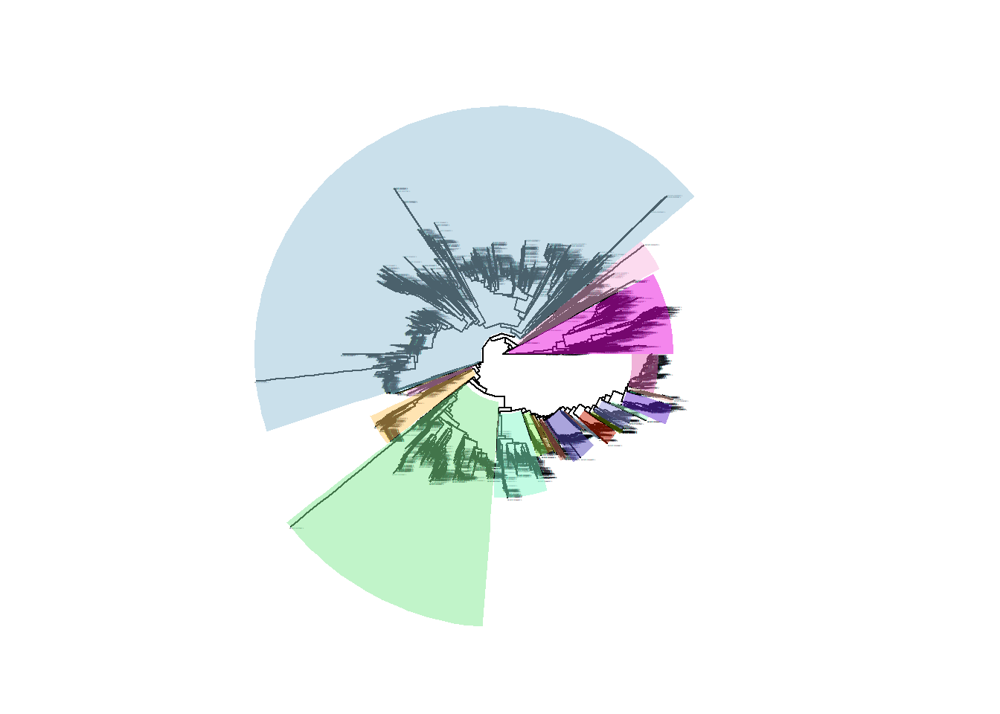

<!-- README.md is generated from README.Rmd. Please edit that file -->
# **README**

## **R code for: Parras-Moltó & Aguirre de Cárcer, 2019**

This document describes the use of FunCongr.R, as presented in "Assessment of phylo-functional coherence along the bacterial phylogeny and taxonomy"" by Parras-Moltó and Aguirre de Cárcer (<https://www.biorxiv.org/content/10.1101/795914v1>).The procedure employed trees, taxonomic assignments, and 16S rRNA gene sequences from GTDB (<https://gtdb.ecogenomic.org>), as well as the full list of genome annotations from proGenomes (<http://progenomes.embl.de/>).

    R version 3.6.1 (2019-07-05)

### **FunCongr.R**

### **Dependencies**

**Packages**

· `ape` v5.3. Analyses of phylogenetics and evolution

· `tree` v1.0.40. Fit a classification or regression tree

· `gtools` v3.8.2. Various R programming tools

· `phangorn` v2.5.5. Phylogenetic analysis in R

**Files located in the same folder as the script**

1- gtdb\_r86.ssu.bacteria.fasttree\_name\_pruned.tree 2- tab\_info\_pair.txt

Before the use of the script itself we prepared the input data; First we transformed genome annotations into a binary presence/absence table of gene content per genome (COG annotations were employed for consistency, representing &gt;77% of the total annotations).

``` r
tab_pres=read.table("info_cogs.txt",header=T)
head(tab_pres[,1:8])
##                  Acc   TaxID COG0816 COG4584 COG0313 COG4332 COG3601 COG4063
## 1 RS_GCF_000018045.1  290338       1       0       1       0       0       0
## 2 RS_GCF_001885995.1  888064       1       1       1       0       1       0
## 3 RS_GCF_000744785.1 1449346       1       1       1       0       0       0
## 4 RS_GCF_001495195.1    1639       1       0       1       0       1       0
## 5 RS_GCF_001506165.1  470934       1       0       1       0       0       0
## 6 RS_GCF_000175195.1  637911       1       1       1       0       0       0
```

Then, for each pairwise comparison between genomes we produced 16S rRNA gene distances and Jaccard distances based on gene content (average of A-B and B-A), summarized in a four columns table (tab\_info\_pair.txt).Constant node labels were given to the input tree using makeNodeLabel from ape package in R (\_name). Subsequently, the tree was pruned to contain only leaves with annotated genomes (\_name\_pruned).

``` r
tree=read.tree("gtdb_r86.ssu.bacteria.fasttree_name_pruned.tree") #The tree is loaded here
tab_info_pair=read.table("tab_info_pair.txt") #Within this table we have all the distances values (Jaccard and 16S) for each  posible pair.
tab_info_pair$comb<-paste(tab_info_pair$V1,tab_info_pair$V2,sep = "")

head(tab_info_pair[,1:5])
##                   V1                 V2     V3        V4
## 1 GB_GCA_000091165.1 GB_GCA_000196875.1 0.2334 0.4892320
## 2 GB_GCA_000091165.1 GB_GCA_000317655.1 0.2377 0.4270270
## 3 GB_GCA_000091165.1 GB_GCA_000385635.1 0.2534 0.6736905
## 4 GB_GCA_000091165.1 GB_GCA_000392435.1 0.2682 0.6837099
## 5 GB_GCA_000091165.1 GB_GCA_000402635.1 0.2295 0.5173160
## 6 GB_GCA_000091165.1 GB_GCA_000447245.1 0.2268 0.4548976
##                                   comb
## 1 GB_GCA_000091165.1GB_GCA_000196875.1
## 2 GB_GCA_000091165.1GB_GCA_000317655.1
## 3 GB_GCA_000091165.1GB_GCA_000385635.1
## 4 GB_GCA_000091165.1GB_GCA_000392435.1
## 5 GB_GCA_000091165.1GB_GCA_000402635.1
## 6 GB_GCA_000091165.1GB_GCA_000447245.1
```

FunCongr.R reads the named\_pruned tree, as well as the four columns table in the same directory, and prints out, fore each evaluated node, node name and hour (nodes passing the test) plus within-node average and standard deviation of Jaccard values (nodes failing the test, e.g. output\_16s.log). The script does not evaluate nodes with fewer than 5 members or nodes presenting descendant nodes that already failed the test. Due to its nature, the script runs in a single processor, which, due to the size of the tree, translated into a lengthy (&gt;400h) run.

The output file is a list of so called "bad nodes". It is checked if our nodes passes the threeshold of the ecdf function. In case the p-value obtained is greater of 0.05, the node is considerated as "bad" and its leaves are saved to avoid the evaluation of the subsequents nodes that posseses the sames leaves.

``` r
node_list=paste(unlist(read.table("bad_nodes.txt")))
print(node_list)
## [1] "Node24704"
```

### **Paint\_tree.R**

The results are later parsed with Paint\_tree.R, which reads in the same directory the same tree and four columns table, as well as the metadata table containing the taxonomic affiliation of each leave (bac\_metadata\_r86.tsv) and a list of failing nodes identified with FunCongr.R (e.g. bad\_nodes.txt). The scripts follows the rule that non-functionally coherent nodes are those that either failed the test or present a descendant node that failed the test. Then, for each last node were functional congruence was observed along each branching path it outputs a table with node ID, node label, number of leaves, and average plus standard deviation values of within-node 16S rRNA gene and Jaccard-based distances, and the node's 80% consensus taxonomy) (nodes\_info.txt), as well as a painted tree as a pdf image.

### **Dependencies**

**Packages**

· `ape` v5.3. Analyses of phylogenetics and evolution

· `tree` v1.0.40. Fit a classification or regression tree

· `phangorn` v2.5.5. Phylogenetic analysis in R

· `phytools` v0.7.70. Phylogenetic tools for comparative biology (and other things)

· `ggtree` v1.16.6. Visualizing phylogenetic tree

· `ggplot2` v3.3.2. Create elegant data visualisations using the grammar of graphics

· `randomcoloR` v1.1.0.1. Get a pretty random color

· `tidygraph` v1.2.0. A tidy API for graph manipulation

**Files located in the same folder as the script**

1- gtdb\_r86.ssu.bacteria.fasttree\_name\_pruned.tree 2- tab\_info\_pair.txt 3- bac\_metadata\_r86.tsv(<https://data.gtdb.ecogenomic.org/releases/release86/86.0/bac_metadata_r86.tsv>) 4- bad\_nodes.txt

**Resulting plot**



Resulting nodes info are saved to "node\_info.txt" file, with the: "Node","ID","Leaves","Jaccard mean","Jaccard sd","16S mean","16S sd" and "Taxonomy" information fields.

``` r
head(data_out_res)
##        Node   ID Leaves Jaccard mean Jaccard sd 16S mean 16S sd
## 1    Node11 5873    458        0.344      0.114    0.206  0.049
## 2  Node2214 6338    176        0.462      0.146     0.25  0.069
## 3  Node2735 6510   2591        0.452      0.119    0.212  0.059
## 4 Node15004 8963     28        0.406       0.19    0.192  0.067
## 5 Node15131 8991     10        0.318      0.114    0.173  0.073
## 6 Node15174 9001      5        0.349      0.168    0.172   0.09
##                                      Taxonomy
## 1 ;d__Bacteria;p__Bacteroidota;c__Bacteroidia
## 2                                ;d__Bacteria
## 3                                ;d__Bacteria
## 4                                ;d__Bacteria
## 5                                ;d__Bacteria
## 6                                ;d__Bacteria
```
